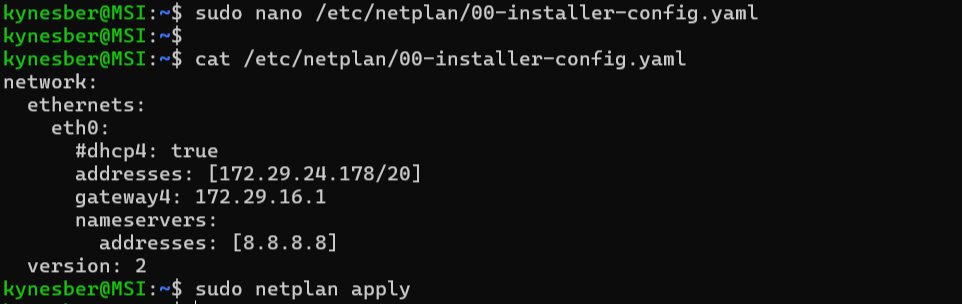
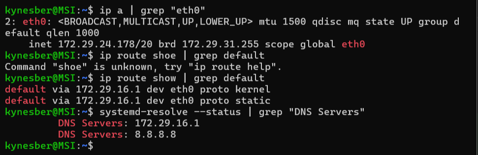
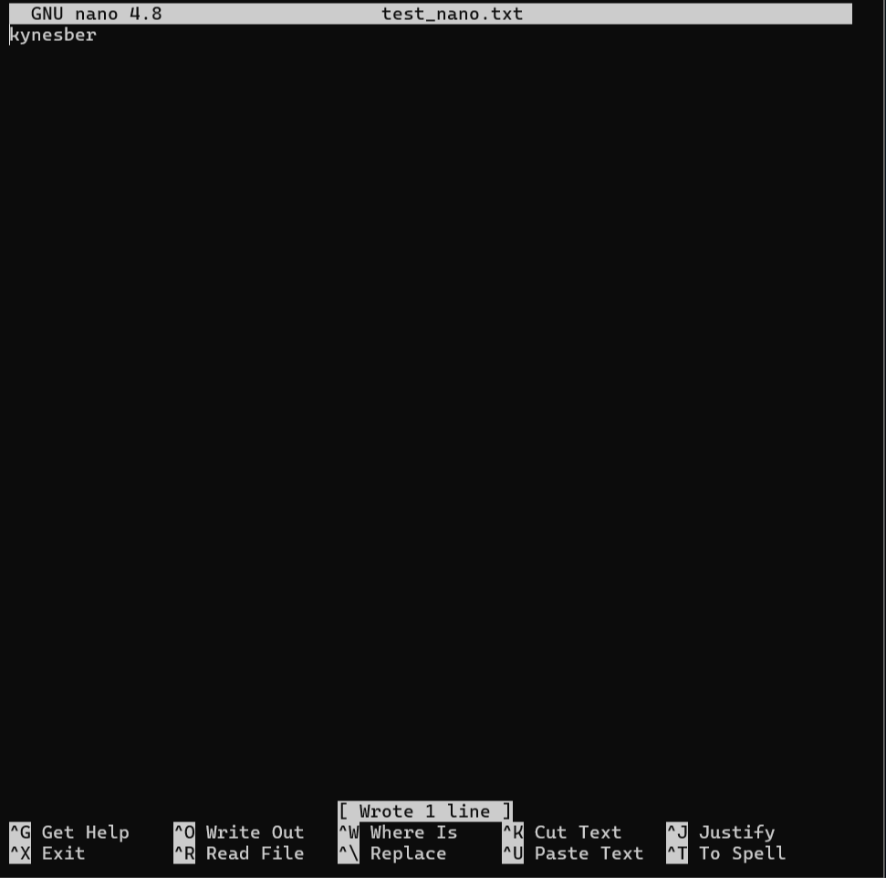
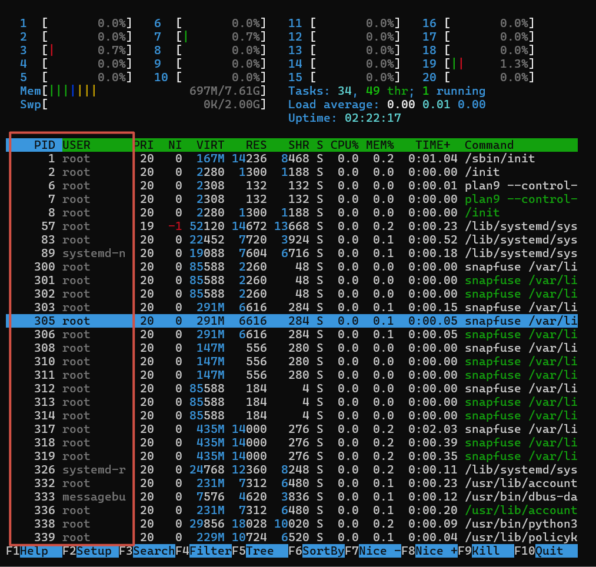

## Part 1. Установка ОС

**== Задание ==**

##### Установи **Ubuntu 20.04 Server LTS** без графического интерфейса. (Используем программу для виртуализации - VirtualBox)

- Графический интерфейс должен отсутствовать.

- Узнай версию Ubuntu, выполнив команду \
`cat /etc/issue.`
- Вставь скриншот с выводом команды.

**== Решение ==**

* Выполнение команды `cat /etc/issue.`

 

## Part 2. Создание пользователя

**== Задание ==**

##### Создай пользователя, отличного от созданного при установке. Пользователь должен быть добавлен в группу `adm`.

- Вставь скриншот вызова команды для создания пользователя.
- Новый пользователь должен быть в выводе команды \
`cat /etc/passwd`
- Вставь скриншот с выводом команды.

**== Решение ==**

* Вызов команды для создания пользователя sudo adduser new_username.

* Добавление нового пользователя в группу adm с помощью команды  sudo usermod -aG adm new_username и вывод команды cat /etc/passwd.

 

## Part 3. Настройка сети ОС

**== Задание ==**

##### Задай название машины вида user-1.
##### Установи временную зону, соответствующую твоему текущему местоположению.  
##### Выведи названия сетевых интерфейсов с помощью консольной команды.
- В отчёте дай объяснение наличию интерфейса lo.  
##### Используя консольную команду, получи ip адрес устройства, на котором ты работаешь, от DHCP сервера. 
- В отчёте дай расшифровку DHCP.  
##### Определи и выведи на экран внешний ip-адрес шлюза (ip) и внутренний IP-адрес шлюза, он же ip-адрес по умолчанию (gw). 
##### Задай статичные (заданные вручную, а не полученные от DHCP сервера) настройки ip, gw, dns (используй публичный DNS серверы, например 1.1.1.1 или 8.8.8.8).  
##### Перезагрузи виртуальную машину. Убедись, что статичные сетевые настройки (ip, gw, dns) соответствуют заданным в предыдущем пункте.  

- В отчёте опиши, что сделал для выполнения всех семи пунктов (можно как текстом, так и скриншотами).
- Успешно пропингуй удаленные хосты 1.1.1.1 и ya.ru и вставь в отчёт скрин с выводом команды. В выводе команды должна быть фраза «0% packet loss».

**== Решение ==**

* Задаем название машины с помощью sudo hostnamectl set-hostname user-1 и проверяем имя машины с помощью hostname.

* Просмотр доступных временнх зон, которые можно установить, с помощью команды timedatectl list-timezones (последняя строка на скриншоте в пункте 1). Находим строку Europe/Moscow. Пользуемся командой sudo timedatectl set-timezone Europe/Moscow для установки временной зоны. Проверяем текущую временную зону с помощью timedatectl.

* Выводим названия всех сетевых интерфейсов с помощью  ip link show.

Lo (loopback device) – виртуальный интерфейс, присутствующий по умолчанию в любом Linux. Он используется для отладки сетевых программ и запуска серверных приложений на локальной машине. С этим интерфейсом всегда связан адрес 127.0.0.1. У него есть dns-имя – localhost.

* С помощью команды ip address получаем ip адрес устройства, на котором работаем, от DHCP сервера.

DHCP (англ. Dynamic Host Configuration Protocol — протокол динамической настройки узла) — сетевой протокол, позволяющий сетевым устройствам автоматически получать IP-адрес и другие параметры, необходимые для работы в сети TCP/IP.

* Вывод внешнего ip-адреса устройства с помощью команды curl ifconfig.me. Вывод внутреннего ip-адреса шлюза с помощью ip route | grep default | awk '{print $3}'.

* Открываем файл конфигурации сетевых интерфейсов для редактирования /etc/netplan/00-installer-config.yaml с помощью nano. Добавляем необходимую информацию. Применяем настройки сети, используя sudo netplan apply.

* Перезагружаем машину и проверяем настройки сети. Пропингуем удаленный хост 1.1.1.1  и ya.ru с помощью ping

 

## Part 4. Обновление ОС

**== Задание ==**

##### Обнови системные пакеты до последней на момент выполнения задания версии.  

- После обновления системных пакетов, если ввести команду обновления повторно, должно появиться сообщение, что обновления отсутствуют;
- Вставь скриншот с этим сообщением в отчёт.

**== Решение ==**

* Проверяем доступные пакеты с помощью sudo apt update.Обновляем систему до последней версии с помощью sudo apt upgrade. Проверяем, что нет больше обновлений.

 

## Part 5. Использование команды **sudo**

**== Задание ==**

##### Разреши пользователю, созданному в [Part 2](#part-2-создание-пользователя),выполнять команду sudo.

- В отчёте объясни *истинное* назначение команды sudo (про то, что это слово - «волшебное», писать не стоит);  
- Поменяй hostname ОС от имени пользователя, созданного в пункте [Part 2](#part-2-создание-пользователя) (используя sudo);
- Вставь скрин с изменённым hostname в отчёт.

**== Решение ==**

Sudo — это утилита, предоставляющая привилегии root для выполнения административных операций в соответствии со своими настройками. Она позволяет легко контролировать доступ к важным приложениям в системе. По умолчанию, при установке Ubuntu первому пользователю (тому, который создаётся во время установки) предоставляются полные права на использование sudo.

* Разрешим пользователю из Part 2 использовать sudo с помощью sudo usermod -aG sudo new_user_name. Перезагружаем с помощью команды reboot. Переходим на второго пользователя. Задаем название новой машины с помощью sudo hostnamectl set-hostname user-2. Проверяем имя машины.

 

## Part 6. Установка и настройка службы времени

**== Задание ==**

##### Настрой службу автоматической синхронизации времени.  

- Выведи время часового пояса, в котором ты сейчас находишься.
- Вывод следующей команды должен содержать `NTPSynchronized=yes`: \
  `timedatectl show`
- Вставь скрины с корректным временем и выводом команды в отчёт.

**== Решение ==**

* Время часового пояса, в котором я нахожусь. Вывод команды timedatectl show.

 

## Part 7. Установка и использование текстовых редакторов

**== Задание ==**

##### Установи текстовые редакторы **VIM** (+ любые два по желанию **NANO**, **MCEDIT**, **JOE** и т.д.)  
##### Используя каждый из трех выбранных редакторов, создай файл *test_X.txt*, где X -- название редактора, в котором создан файл. Напиши в нём свой никнейм, закрой файл с сохранением изменений.  
- В отчёт вставь скриншоты:
  - Из каждого редактора с содержимым файла перед закрытием;
- В отчёте укажи, что сделал для выхода с сохранением изменений.
##### Используя каждый из трех выбранных редакторов, открой файл на редактирование, отредактируй файл, заменив никнейм на строку «21 School 21», закрой файл без сохранения изменений.
- В отчёт вставь скриншоты:
    - Из каждого редактора с содержимым файла после редактирования;
- В отчёте укажи, что сделал для выхода без сохранения изменений.
##### Используя каждый из трех выбранных редакторов, отредактируй файл ещё раз (по аналогии с предыдущим пунктом), а затем освой функции поиска по содержимому файла (слово) и замены слова на любое другое.
- В отчёт вставь скриншоты:
    - Из каждого редактора с результатами поиска слова;
    - Из каждого редактора с командами, введёнными для замены слова на другое.

**== Решение ==**

* Устанавливаем редакторы vim, nano, mcedit с помощью команды sudo apt install имя_редактора.

* vim:
	создаем и редактируем файл с помощью команды vim test_vim.txt.
	в открывшемся редакторе нажимаем клавишу i, чтобы перейти в режим вставки.
	в режиме вставки пишем kynesber.
	нажимаем клавишу esc, чтобы выйти из режима вставки.
	вводим команду :wq, чтобы выйти с сохранением.

	nano:
	пишем команду nano test_nano.txt.
	в открывшемся редакторе пишем kynesber.
	нажимаем комбинацию клавиш ctrl+O для сохранения изменений.
	далее нажимаем enter, т.к. нам не нужно менять название файла.
	нажимаем комбинацию ctrl+X для выхода.

	mcedit:
	вводим команду mcedit test_mcedit.txt.
	в открывшемся редакторе пишем kynesber.
	нажимаем клавишу f10 для выхода с сохранением.

* vim:
	пишем команду vim test_vim.txt.
	в открывшемся редакторе нажимаем клавишу i, чтобы перейти в режим вставки.
	меняем kynesber на 21 School 21.
	нажимаем клавишу esc, чтобы выйти из режима вставки.
	вводим команду :q!, чтобы выйти без сохранения.

	nano:
	пишем команду nano test_nano.txt.
	меняем kynesber на 21 School 21.
	нажимаем комбинацию ctrl+X для выхода.
	нажимаем N на предложение сохранить изменения.

	mcedit:
	вводим команду mcedit test_mcedit.txt.
	меняем kynesber на 21 School 21.
	нажимаем клавишу f10 для выхода без сохранения.
	отказываемся от сохранения.

* vim:
	пишем команду vim test_vim.txt.
	в открывшемся редакторе нажимаем клавишу i, чтобы перейти в режим вставки.
	добавляем слово rabbit.
	нажимаем клавишу esc, чтобы выйти из режима вставки.
	пишем команду /rabbit для поиска слова и перехода к нему.
	пишем команду :%s/rabbit/bread/g для замены слова rabbit на bread (% - обозначает, что замена будет выполнена во всем файле; s - означает "заменить"; rabbit - это слово, которое нужно заменить; bread - это слово, на которое нужно заменить; g - означает "глобальную" замену, которая заменит все вхождения слова "rabbit" в строке).
	вводим команду :wq для выхода с сохранением.

	nano:
	пишем команду nano test_nano.txt.
	добавляем слово rabbit.
	нажимаем комбинацию ctrl+/, чтобы сделать замену.
	вводим rabbit в поиске, bread в строку для замены.
	подтверждаем операцию - Y.
	нажимаем комбинацию ctrl+x для выхода.

	mcedit:
	вводим команду mcedit test_mcedit.txt.
	добавляем rabbit.
	нажимаем клавишу f4 для замены.
	вводим слово rabbit для поиска и bread для замены.
	подтвержаем наше действие нажав клавишу Заменить в открывшемся меню.
	нажимаем клавишу F10 для выхода с сохраненем.
	подтвержаем сохранение в открывшемся окне выбрав Да.

 

## Part 8. Установка и базовая настройка сервиса **SSHD**

**== Задание ==**

##### Установи службу SSHd.  
##### Добавь автостарт службы при загрузке системы.  
##### Перенастрой службу SSHd на порт 2022.  
##### Используя команду ps, покажи наличие процесса sshd. Для этого к команде нужно подобрать ключи.
- В отчёте объясни значение команды и каждого ключа в ней.
##### Перезагрузи систему.
- В отчёте опиши, что сделал для выполнения всех пяти пунктов (можно как текстом, так и скриншотами).
- Вывод команды netstat -tan должен содержать  \
`tcp 0 0 0.0.0.0:2022 0.0.0.0:* LISTEN`  \
(если команды netstat нет, то ее нужно установить)
- Скрин с выводом команды вставь в отчёт.
- В отчёте объясни значение ключей -tan, значение каждого столбца вывода, значение 0.0.0.0.

**== Решение ==**

* Устанавливаем службу SSHd с помощью команды sudo apt install openssh-server.

* Чтобы добавить автостарт службы при загрузке системы, сначала необходимо узнать имя связанного с ней файла-юнита. Выполним команду sudo systemctl status ssh. В строке Loaded будет находится необходимый нам файл. Добавляем службу в автостарт с помощью sudo systemctl enable имя_искомого_файла.

* Для того, чтобы настроить службу на порт 2022, откроем файл конфигурации /etc/ssh/sshd_config. Строку #Port 22 меняем на #Port 2022. После внесения изменений, перезапустим службу, чтобы применить новый порт.

* Чтобы показать наличие процесса sshd, выполним команду ps -C sshd -o pid,cmd, где -C sshd позволяет отобразить только процессы с именем команды sshd, -o pid,cmd задает формат вывода, чтобы показать только идентификаторы процессов (PID) и команды запуска процесса (CMD).

* Перезагружаем систему командой reboot. Загружаем необходимые команды sudo apt install net-tools. Выполняем команду netstat -tan.

Команда netstat (network statistics) предоставляет информацию о состоянии сетевых подключений и сетевых статистиках в Linux. Когда команда netstat используется с опциями -tan, она показывает список всех активных сетевых соединений (TCP и UDP) на машине, а также отображает числовые значения портов и IP-адресов. Расшифровка опций netstat -tan:

-t: Отображает информацию только о TCP-соединениях.

-a: Показывает все сетевые соединения, включая активные и прослушивающие (listening) порты.

-n: Выводит числовые значения IP-адресов и портов вместо их разрешенных имен.

Значение каждого столбца вывода:

Proto: Протокол сетевого соединения. В данном случае, это TCP (Transmission Control Protocol), так как мы используем опцию -t, чтобы отобразить только TCP-соединения.

Recv-Q и Send-Q: Количество байт данных, ожидающих чтения (Recv-Q) и отправки (Send-Q) в буферах сокетов. Обычно эти значения равны нулю или очень малы, если соединение не перегружено.

Local Address: Локальный адрес и порт, на котором работает процесс или служба. В формате IP:порт. 0.0.0.0 означает, что служба прослушивает на всех доступных IP-адресах.

Foreign Address: Внешний адрес и порт, с которого идет или куда направляется соединение. В формате IP:порт. Если соединение является входящим (например, к серверу), здесь будет указан IP и порт источника. Если соединение является исходящим (например, от сервера к клиенту), здесь будет указан IP и порт назначения.

State: Состояние TCP-соединения. Здесь отображается текущее состояние соединения. Некоторые распространенные состояния включают LISTEN (слушание, когда сервер ожидает входящих подключений), ESTABLISHED (установлено активное TCP-соединение), TIME_WAIT (соединение закрыто и ждет окончания всех пакетов), и т.д.

 

## Part 9. Установка и использование утилит **top**, **htop**

**== Задание ==**

##### Установи и запусти утилиты top и htop.  

- По выводу команды top определи и напиши в отчёте:
  - uptime
  - количество авторизованных пользователей
  - общую загрузку системы
  - общее количество процессов
  - загрузку cpu
  - загрузку памяти
  - pid процесса занимающего больше всего памяти
  - pid процесса, занимающего больше всего процессорного времени
- В отчёт вставь скрин с выводом команды htop:
  - отсортированному по PID, PERCENT_CPU, PERCENT_MEM, TIME
  - отфильтрованному для процесса sshd
  - с процессом syslog, найденным, используя поиск 
  - с добавленным выводом hostname, clock и uptime

**== Решение ==**

По выводу top определили:

Uptime: 13:16:33.
Количество авторизированных пользователей: 1.
Общую загрузку системы: 0.00, 0.01, 0.00.
Общее количество процессов: 34.
Загрузку cpu: 0.0 us, 0.3 sys, 0.0 ni, 99.7 id, 0.0 wa, 0.0 hi, 0.0 si, 0.0 st.
Загрузку памяти: 7796.5 total, 6332.4 free, 689.1 used, 775.0 buff/cache.
Pid процесса, занимающего больше всего памяти: 344.
Pid процесса, занимающего больше всего процессорного времени: 344.

htop:

отсортированный по PID, PERCENT_CPU, PERCENT_MEM, TIME

отфильтрованный для процесса sshd

с процессом syslog, найденным, используя поиск

с добавленным выводом hostname, clock и uptime

 

## Part 10. Использование утилиты **fdisk**

**== Задание ==**

##### Запусти команду fdisk -l.

- В отчёте напиши название жесткого диска, его размер и количество секторов, а также размер swap.

**== Решение ==**

Название жесткого диска: Virtual Disk.
Размер: 388.52 MiB.
Количество секторов: 795664.
Размер swap: 00.0 B.

 

## Part 11. Использование утилиты **df**

**== Задание ==**

##### Запусти команду df.  
- В отчёте напиши для корневого раздела (/):
  - размер раздела
  - размер занятого пространства
  - размер свободного пространства
  - процент использования
- Определи и напиши в отчёт единицу измерения в выводе.  

##### Запусти команду df -Th.
- В отчёте напиши для корневого раздела (/):
    - размер раздела
    - размер занятого пространства
    - размер свободного пространства
    - процент использования
- Определи и напиши в отчёт тип файловой системы для раздела.

**== Решение ==**

* df:

размеры указаны в Кб

* df -Th:

 

## Part 12. Использование утилиты **du**

**== Задание ==**

##### Запусти команду du
##### Выведи размер папок /home, /var, /var/log (в байтах, в человекочитаемом виде)
##### Выведи размер всего содержимого в /var/log (не общее, а каждого вложенного элемента, используя *)

- В отчёт вставь скрины с выводом всех использованных команд.

**== Решение ==**

* Команда sudo du -s -B1 /имя выведет размер в байтах. Команда sudo du -sh /имя выведет размер в человекочитаемом виде.

* Команда sudo du -h /var/log/* выведет размеры содержимого папки.

 

## Part 13. Установка и использование утилиты **ncdu**

**== Задание ==**

##### Установи утилиту ncdu
##### Выведи размер папок /home, /var, /var/log

- Размеры должны примерно совпадать с полученными в [Part 12](#part-12-использование-утилиты-du).

- В отчёт вставь скрины с выводом использованных команд.

**== Решение ==**

* Устанавливаем утилиту с помощью команды sudo apt install ncdu.

* Используем команды ncdu /home, ncdu /var, ncdu /var/log. Внизу отображается общий размер каталогов.

 

## Part 14. Работа с системными журналами

**== Задание ==**

##### Открой для просмотра:
##### 1. /var/log/dmesg
##### 2. /var/log/syslog
##### 3. /var/log/auth.log  

- Напиши в отчёте время последней успешной авторизации, имя пользователя и метод входа в систему;
- Перезапусти службу SSHd;
- Вставь в отчёт скрин с сообщением о рестарте службы (искать в логах).

**== Решение ==**

/var/log/dmesg содержит информацию о буфере ядра. 

/var/log/syslog регистрирует все, кроме сообщений, связанных с аутентификацией.

/var/log/auth.log управляет сообщениями, связанными с аутентификацией.

- Чтобы определить время последней успешной авторизации, имя пользователя и метод входа в систему, нужно просмотреть файл /var/log/auth.log.

- Перезагружаем службу с помощью команды sudo systemctl restart sshd.

- Сообщение об этом будет в файле /var/log/syslog.

 

## Part 15. Использование планировщика заданий **CRON**

**== Задание ==**

##### Используя планировщик заданий, запусти команду uptime через каждые 2 минуты.
- Найди в системных журналах строчки (минимум две в заданном временном диапазоне) о выполнении;
- Выведи на экран список текущих заданий для CRON;
- Вставь в отчёт скрины со строчками о выполнении и списком текущих задач.

##### Удали все задания из планировщика заданий.
- В отчёт вставь скрин со списком текущих заданий для CRON.

**== Решение ==**

* Добавляем новую задачу с помощью команды crontab -e. Выбираем редактор. Добавляем строку, описывающую команду. Сохраняем и выходим. Выводим список заданий с помощью crontab -l. Открываем файл /var/log/syslog, чтобы проверить работает ли наше задание.

* Удаляем задание командой crontab -r. Выводим список заданий.

 